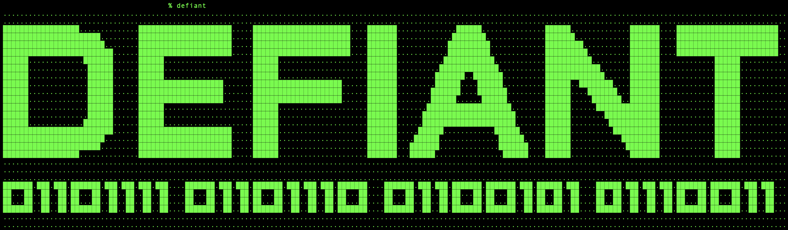

## Defiant0
Terminal shell script with logo for Defiant Ones

# Instructions
Install defiant.sh
Open your terminal emulator
Change to the directory where defiant.sh is stored
Type: chmod +x defiant.sh
Type: sudo mv dc.sh /usr/local/bin/defiant
Type: defiant
Enjoy!